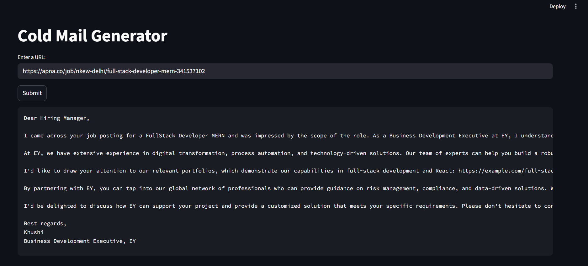

# 🚀 AI-Powered Cold Email Generator (RAG Pipeline)

This project is an AI-powered cold email generation system designed for **sales and business development teams** to create **highly contextual B2B outreach emails**.

The system uses **job descriptions as intent signals** to infer a company’s current needs (such as engineering, data, cloud, or security requirements). Based on this context, it retrieves the **most relevant portfolio projects** using semantic search and generates a **personalized cold email** aligned with those needs.

The application follows a **Retrieval-Augmented Generation (RAG)** architecture, ensuring that the generated emails are:
- Context-aware
- Grounded in real portfolio data
- Tailored to the role a company is hiring for

The system follows a Retrieval-Augmented Generation (RAG) architecture using **LangChain**, **Groq LLM**, **ChromaDB**, and **Streamlit**.

## Screenshot



# 🧠 Why This Is a RAG Pipeline

**RAG = Retrieval + Augmentation + Generation**

This project satisfies all three:

* **Retrieval:** Relevant portfolio projects are retrieved from a vector database (**ChromaDB**) based on job skills.
* **Augmentation:** Retrieved portfolio links are injected into the LLM prompt.
* **Generation:** The LLM generates a grounded, personalized cold email using retrieved data.

The LLM does not rely solely on its internal knowledge, making this a true RAG system.


# 🏗️ Project Architecture

`Job Description / URL` → `Web Scraping & Cleaning` → `LLM-based Job Extraction` → `Skill-based Semantic Search` → `ChromaDB (Vector Store)` → `Relevant Portfolio Links` → `LLM Prompt Augmentation` → `Cold Email Generation` → `Streamlit UI`


# 🛠️ Tech Stack

* **Python 3.11**
* **LangChain** (Orchestration)
* **Groq (LLaMA-3.3-70B)** (LLM)
* **ChromaDB** (Vector Database)
* **Sentence-Transformers (MiniLM)** (Embeddings)
* **Streamlit** (Frontend)
* **Pandas** (Data Handling)


# 🚀 How to Run the Project

### 1️⃣ Activate Conda Environment
```bash
conda activate langchain

2️⃣ Set Environment Variables
Create a .env file inside App/resource/:

GROQ_API_KEY=your_groq_api_key_here
3️⃣ Run the Streamlit App

python -m streamlit run App/main.py
